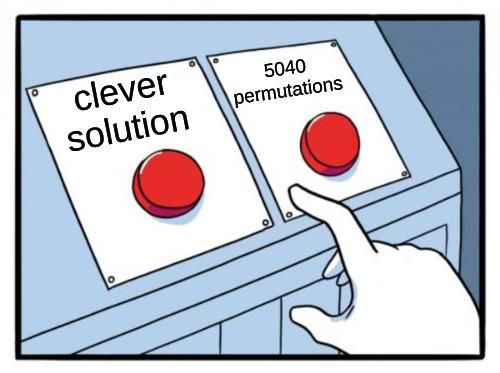

# Ищем интересное в AoC 2021 

## Day 8. 7-segment displays

Условие: https://adventofcode.com/2021/day/8

### itertools.permutations



```python
from itertools import permutations

*good, = map(set, ['abcefg','cf',       # Correct segments for each digit.
  'acdeg','acdfg','bcdf','abdfg',       # Segments for 0 are at position 0, etc.
  'abdefg','acf','abcdefg','abcdfg'])  

s = 0
for x,y in [x.split("|") for x in open(0)]:
  for p in permutations('abcdefg'):     # For each possible wiring permutation,
    wires = dict(zip('abcdefg', p))     # create a dictionary to translate them.

    def trans(displays):
      out = 0
      for d in displays.split():        # For each of the segment displays:
        t = [wires[s] for s in d]       # 1. translate each segment using dict,
        digit = good.index(set(t))      # 2. look up to which digit they belong,
        out = 10*out + digit            # 3. add this digit to the output value.
      return out

    try:                                # Try translating using this dictionary.
        _ = trans(x)                    # If we can trans. all signal patterns,
        s += trans(y)                   # it must be correct, so we add output.
    except ValueError:                  # If we hit a translation error, we try
        pass                            # the next wiring permutation.
print(s)
```

### Размер пересечения с известными цифрами

Цифры 1 4 7 8 — определяются по количеству сегментов.
2 3 5 можно отличить друг от друга по количеству пересечений сегментов с уже известными цифрами.
6 9 0 — аналогично.

Например так:

```python
def solve():
    ans2 = 0
    for signals, displays in entries:
        def find_signal(segments_count, other_digit='', intersection_size=0):
            candidates = [
                s for s in signals
                if len(s) == segments_count
                and len(set(other_digit) & set(s)) == intersection_size]
            assert len(candidates) == 1
            return ''.join(sorted(candidates[0]))

        d1 = find_signal(2)
        d4 = find_signal(4)
        d7 = find_signal(3)
        d8 = find_signal(7)
        d3 = find_signal(5, d1, 2)
        d2 = find_signal(5, d4, 2)
        d5 = find_signal(5, d2, 3)
        d6 = find_signal(6, d1, 1)
        d9 = find_signal(6, d3, 5)
        d0 = find_signal(6, d5, 4)
        mapping = dict([(d1, 1), (d2, 2), (d3, 3), (d4, 4), (d5, 5), (d6, 6), (d7, 7), (d8, 8), (d9, 9), (d0, 0)])

        n = 0
        for display in displays:
            n = n*10 + mapping[''.join(sorted(display))]
        ans2 += n
    return ans2
```

### Вычитание множеств

```python
def decode_digits(x):
  cc = {x.count(c):c for c in 'abcdefg'}                           #   A
  sB = {cc[6]}; sE = {cc[4]}; sF = {cc[9]}                         #  B C
  ss = {len(d):set(d) for d in x.split()}                          #   D
  d1 = ss[2]; d4 = ss[4]; d7 = ss[3]; d8 = ss[7]                   #  E F
  sD = d4-d1-sB; sC = d1-sF  # sA=d7-d1; sG=d8-d4-d7 - not needed  #   G
  return d8-sD,d1,d8-sB-sF,d8-sB-sE,d4,d8-sC-sE,d8-sC,d7,d8,d8-sE
```

### Ещё короче!

Если отсортировать сигналы по хитрому критерию, все встанет на свои места!

```python
ans1 = ans2 = 0
for line in data.splitlines():
    seqs = [frozenset(seq) for seq in re.findall(r'\w+', line)]
    _1,_7,_4, *pending,_8 = sorted(set(seqs), key=len)
    sorter = lambda x: [len(x &_8), len(x &_4), len(x &_1)]
    _2,_5,_3,_6,_0,_9 = sorted(pending, key=sorter)
    ns = [_0,_1,_2,_3,_4,_5,_6,_7,_8,_9]
    ans1 += sum(x in {_1, _7, _4, _8} for x in seqs[-4:])
    ans2 += int(''.join(str(ns.index(x)) for x in seqs[-4:]))
```

---

Автор большинства сниппетов выше не я — они взяты [из реддита](https://www.reddit.com/r/adventofcode/) твиттера или нашего [телеграм чата](https://t.me/konturAoC2021_chat).
