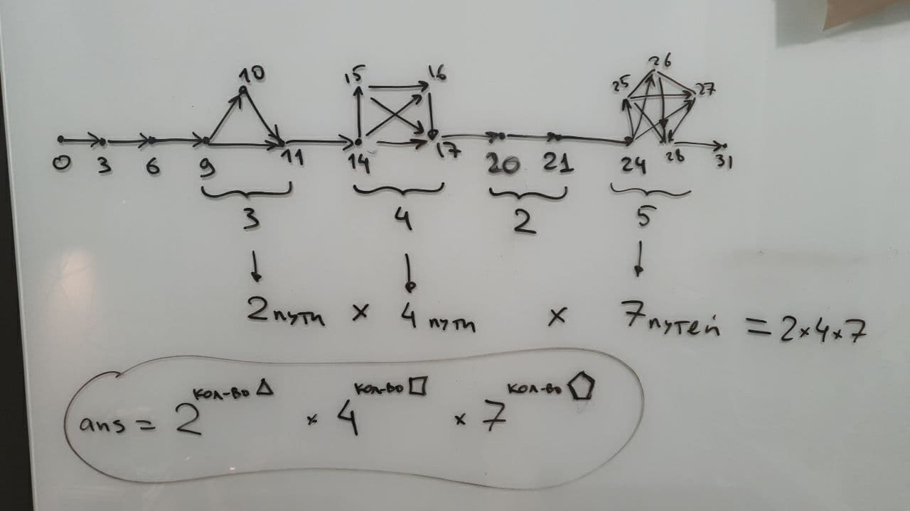

# aoc2020

## Чему научился

Day 1. Для задачи 3-sum есть квадратичное решение за O(1) доп-памяти, которое спрашивают на интервью в гугл :))

Day 2. Хранить инпут прямо в коде с помощью многострочных строк. `"""input"""`

Day 3. Считать количество подходящих элементов в списке с помощью sum: `sum(condition(x) for x in somelist)`

Day 4. Не забывать $ или \b в регулярках, чтобы прерывать их в нужном месте. Делать красиво проверку на диапазон: `if 10 <= x <= 100`

Day 5. Парсить бинарную запись числа `int("01001001", 2)`. `"FBBBF".translate("".maketrans("FB","01"))`. Вычитать set-ы. `set(x) - set(y)`

Day 6. Передавать список аргументов в функцию от нескольких аргументов. `set.intersect(*list_of_sets)`

Day 7. 

* Установил PyCharm. Оказывается все это время я злостно нарушал PEP8! :)
* re.split не умеет пропускать пустые элементы :(
* `s[i:-1]` — это вовсе не "от i и до конца строки". Правильно `s[i:]` :(
* Отлаживать вложенные list comprehensions по сложным вложенным структурам данных почти невозможно :( А вот старый добрый for пишется с первого раза.
* Что возвращают сложные регулярки с множеством групп - так и остается загадкой. На любом языке программирования :( Когда-нибудь нужно разобраться в этом до конца! :)
* В большинстве случаев, когда в голову приходит "BFS!", на самом деле хватит простенького рекурсивного DFS.

Day 8. Началась неделя C#

* Последняя версия Resharper ещё не умеет фичи C# 9. Надо ставить EAP.
* В VS Code можно прилично себе жить с C# 9. Рефакторингов не хватает, немного, но в целом норм.
* Top level statements в C# 9 для AoC не удобны. Нужно много точек входа :( А очень хотелось!
* switch expression красив!

Day 9. Хорошо обходиться без возни с индексами там, где это можно!

Day 10. Внезапно, хорошо [пригодился](https://github.com/xoposhiy/aoc2020/blob/main/10_joltage.cs#L17) малоизвестный всем ToLookup.
Удивительно много различных способов решить вторую часть задачи! Собрал все интересные у себя :)

Интересное решение с комбинаторикой и числами трибоначчи, для которого надо было осознать структуру графа возможных соединений:

Day 11. Есть оптимальное решение за O(W x H) для первой части! Для второй можно сделать аналогично, но уже лень.

Day 12. Оказалось, что если сразу моделировать все data record-ами в C#, то получается даже быстрее, чем если возиться с Tuple-ами.
Не хватает примитива Vector с операциями сложения и поворота. Надо будет притащить их из других проектов на всякий случай :)

Day 13. Китайская теорема об остатках! Онлайн-калькулятор для нее!

Day 14. Аналог BFS для перебора всех значений подходящих по маске. Достаточно просто, чтобы сходу реализовать без ошибок.